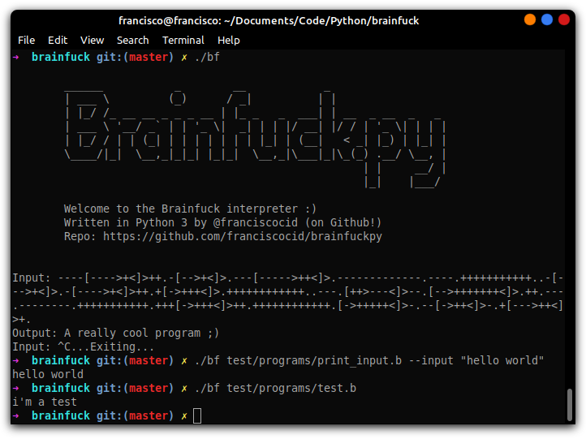

# Brainfuckpy
> A Brainfuck interpreter written in Python 3.

Yet another Brainfuck interpreter ¯_(ツ)_/¯



## Usage

** Requires Python 3 **

OS X & Linux:

```sh
./bf [-h] [--input [INPUT [INPUT ...]]] [--log] [source]
```

Windows:

```sh
bf.bat [-h] [--input [INPUT [INPUT ...]]] [--log] [source]
```

## About Brainfuck

"Brainfuck is an esoteric programming language created in 1993 by Urban Müller, and is notable for its extreme minimalism" - [Wikipedia](https://en.wikipedia.org/wiki/Brainfuck)

Wanna learn how to write Brainfuck programs? [Click here.](https://gist.github.com/roachhd/dce54bec8ba55fb17d3a)

Brainfuck uses only 8 operators:
``+``: Increment current memory value
``-``: Decrement current memory value
``<``: Shift memory pointer to the left
``>``: Shift memory pointer to the right
``,``: Reads user input
``.``: Print current memory value as ASCII
``[``: Start loop
``]``: Ends loop if current memory value is equal to zero

## Development setup

You won't need any library outside of standard python 3, so grab your favorite code editor and have fun.

Runnin testS:
```sh
make tests
```

or

```sh
python3 -m unittest discover test/
```

## Release History

* 0.1.2
    * Command Line arguments
* 0.1.1
    * Readind files
* 0.1.0
    * REPL Interpreter
* 0.0.1
    * Work in progress

## Meta

Francisco Cidade – [/in/francisco-cid](https://www.linkedin.com/in/francisco-cid/)

Distributed under the MIT license. See ``LICENSE.md`` for more information.

[https://github.com/franciscocid/brainfuckpy](https://github.com/franciscocid/)

## Contributing

1. Fork it (<https://github.com/yourname/yourproject/fork>)
2. Create your feature branch (`git checkout -b feature/fooBar`)
3. Commit your changes (`git commit -am 'Add some fooBar'`)
4. Push to the branch (`git push origin feature/fooBar`)
5. Create a new Pull Request